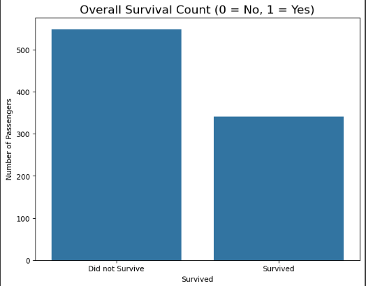
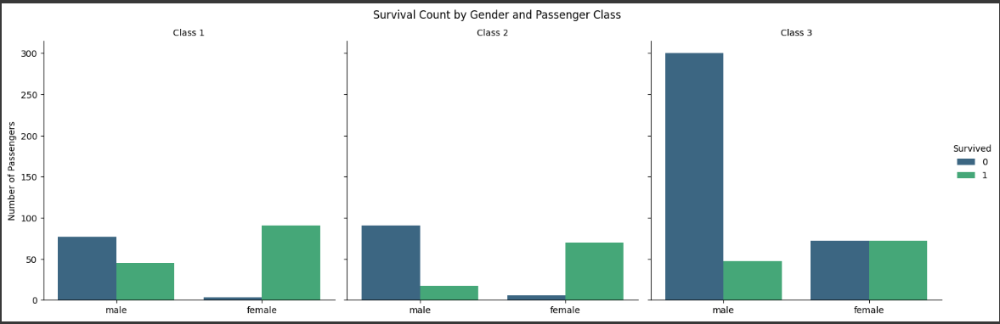
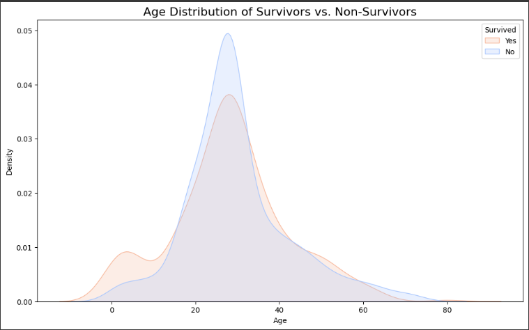

# Task 2: Titanic Dataset - Exploratory Data Analysis (EDA)

## 📜 Problem Statement
Perform data cleaning and exploratory data analysis (EDA) on the Titanic dataset. Explore the relationships between variables and identify patterns and trends in the data.

---

## 🧹 Data Cleaning
* **Missing Age Data:** Filled `NaN` values with the median age, as the distribution was skewed.
* **Missing Cabin Data:** Dropped the 'Cabin' column entirely as over 75% of the data was missing.
* **Missing Embarked Data:** Filled the two missing values with the mode ('S'), the most common port of embarkation.

---

## 📊 Key Findings & Visualizations

### 1. Overall Survival
The analysis began by establishing a baseline for survival. The data shows that significantly more passengers perished than survived, highlighting the severity of the disaster.

### 2. Survival by Class and Gender
This was the most telling insight. Survival was not a matter of luck but was heavily influenced by social status and gender.
* **Gender:** Females had a dramatically higher survival rate than males across all classes.
* **Class:** First-class passengers had a much higher chance of survival than those in third class.

### 3. Survival by Age
The age distribution of survivors shows a notable peak for young children, suggesting they were prioritized during the rescue, aligning with the "women and children first" protocol.

