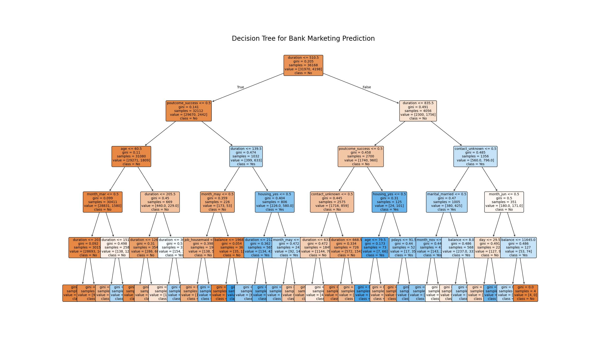

# Task 3: Decision Tree Classifier for Bank Marketing

## 📜 Problem Statement
Build a decision tree classifier to predict whether a customer will purchase a product or service based on their demographic and behavioral data.

---

## ⚙️ Workflow
1.  **Data Loading & Preprocessing:** Loaded the Bank Marketing dataset and converted all categorical features into a numerical format using one-hot encoding.
2.  **Model Training:** A Decision Tree Classifier was trained on the processed data with a maximum depth of 5 to ensure interpretability.
3.  **Evaluation:** The model's performance was assessed on a test set, achieving an accuracy of approximately 90%.

---

## 📊 Key Result: The Decision Tree
The primary value of this model is its interpretability. The tree provides a clear set of rules for marketing strategy. The most significant predictor for a subscription is the `duration` of the last contact.

