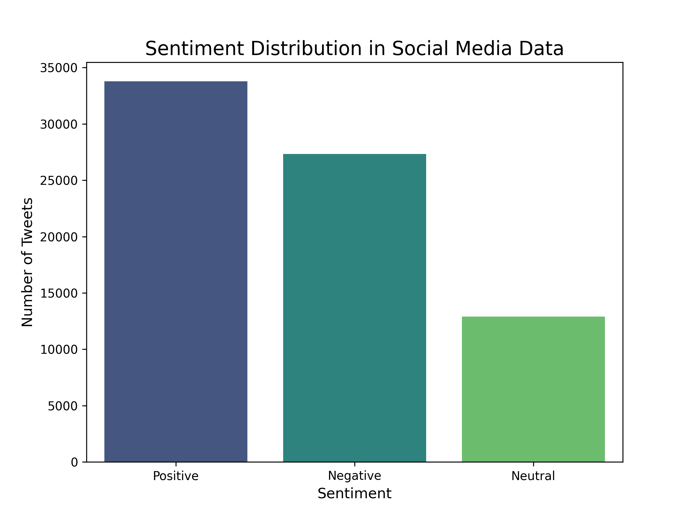

# Task 4: Social Media Sentiment Analysis

## 📜 Problem Statement
Analyze and visualize sentiment patterns in social media data to understand public opinion and attitudes towards specific topics or brands.

---

## ⚙️ Workflow
1.  **Data Loading:** Loaded the Twitter sentiment dataset. The data contained tweet text and the topic it was related to.
2.  **Data Cleaning:** Performed basic cleaning by removing any rows with missing tweet text.
3.  **Sentiment Analysis:** Utilized VADER (Valence Aware Dictionary and sEntiment Reasoner), a pre-trained sentiment analysis model specifically tuned for social media text. Each tweet was classified as 'Positive', 'Negative', or 'Neutral' based on its VADER compound score.
4.  **Visualization:** A bar chart was created to visualize the overall distribution of the classified sentiments.

---

## 📊 Final Visualization
The analysis shows the overall sentiment distribution across the dataset, providing a high-level overview of public opinion within this data.

